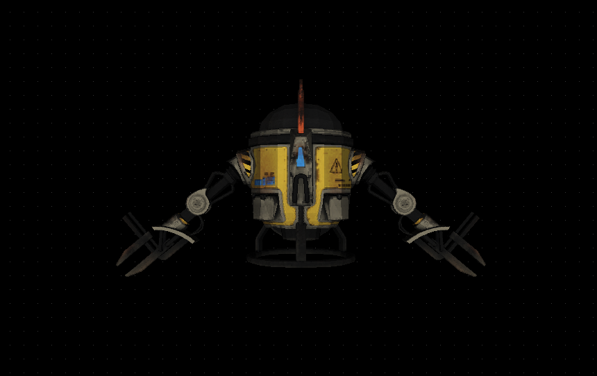

## CPU-based 3D renderer

<table>
    <tr>
        <td></td>
        <td></td>
        <td></td>
    </tr>
</table>
<br/>

This project implements a rudimentary software 3D renderer from scratch. It's based off a [video course](https://pikuma.com/courses/learn-3d-computer-graphics-programming) by Gustavo Pezzi and is written in pure C with [SDL2](https://www.libsdl.org/) as the only dependency (i.e no use of graphics APIs such as OpenGL/Vulkan/DirectX).

Though far from being production-ready (see [known limitations](#current-limitations) below), it covers many of the fundamental aspects of 3D mesh rendering including line drawing, perspective projection, shading, camera views, textures, and more.

A Wasm-compiled demo of the renderer can be viewed at https://rmshin.github.io/3d-renderer-wasm.

### Usage & Examples

To install and run the project locally, you can simply clone the repo and compile it with gcc/clang **(note: you'll need to have the SDL2 graphics library installed)**.

The current Makefile is configured for M1/M2 Macs using homebrew:

```bash
$ gcc -L/opt/homebrew/lib -lSDL2 -lm -I/opt/homebrew/include [other_flags] ./src/*.c -o renderer
```

If you're using other Unix-like systems, you might be able to simply use:

```bash
$ gcc `sdl2-config --cflags --libs` [other_flags] ./src/*.c -o renderer
```

Once the renderer is running, you can control the camera perspective using the standard WASD control keys for movement and left mouse drag for rotation.


There are also several different view options for the meshes that can be toggled via set option keys:

- **1** - display only mesh vertices
- **2** - display only mesh wireframe
- **3** - display mesh fill with wireframe
- **4** - display mesh fill
- **5** - display mesh texture
- **r** - enable/disable auto-rotation of mesh models
- **c** - enable/disable [backface culling](https://en.wikipedia.org/wiki/Back-face_culling)

<table>
    <tr>
        <td>
            
            <br/>
            (1) mesh vertices
        </td>
        <td>
            
            <br/>
            (2) mesh wireframe
        </td>
         <td>
            
            <br/>
            (3) mesh fill with wireframe
        </td>
        <td>
            
            <br/>
            (4) mesh fill
        </td>
    </tr>
    <tr>
        <td>
            
            <br/>
            (5) mesh texture
        </td>
        <td>
            
            <br/>
            (r) rotation
        </td>
         <td>
            
            <br/>
            (c) backface culling
        </td>
        <td></td>
    </tr>
</table>

## Current limitations

As a primarily educational exercise, this project is missing some key features that make it unsuitable in its current state for any serious production usage, including but not limited to:

- Lack of performance checks (redundant calculations, passing structs by value vs reference, no profiling, etc.);
- No tests for memory leaks using profilers such as Valgrind;
- Zero utilisation of modern GPU hardware capabilities for parallelisation;
- Zero utilisation of mature, battle-tested graphics APIs;
- And a host of other missing features for user-facing applications (e.g. [Gouraud shading](https://en.wikipedia.org/wiki/Gouraud_shading)).

## Credits

The f22.obj, efa.obj, and f117.obj aircraft files were created by Artem Katrych.
<br/>
The file crab.obj file was created by [Bohdan Lvov](https://sketchfab.com/ostapblendercg).
<br/>
The drone.obj file was created by [Willy Decarpentrie](https://sketchfab.com/skudgee).
<br/>
3D graphics video course was created by [Gustavo Pezzi](https://pikuma.com/).
